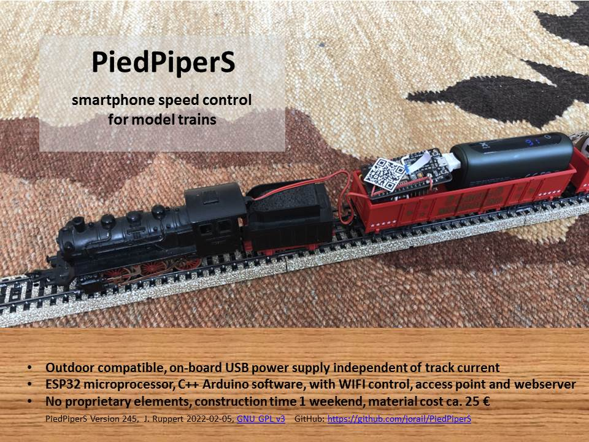
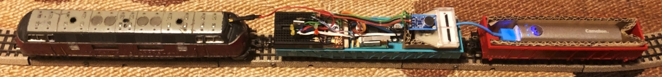
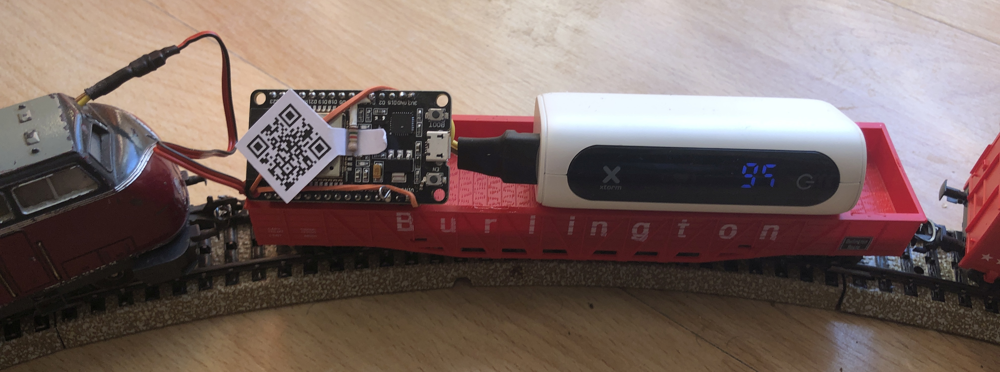
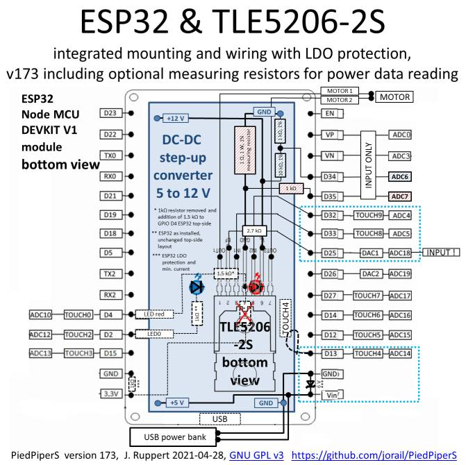
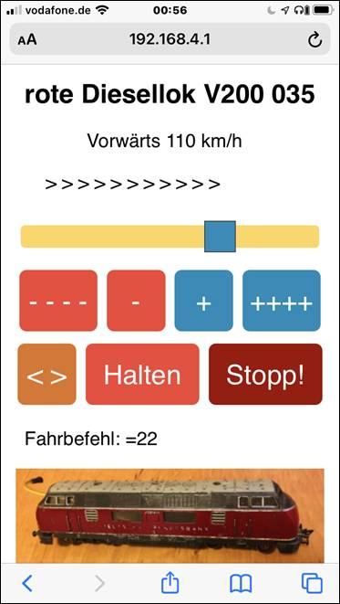
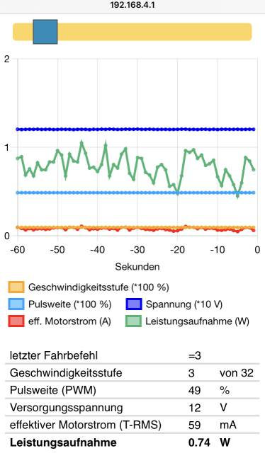
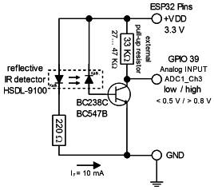
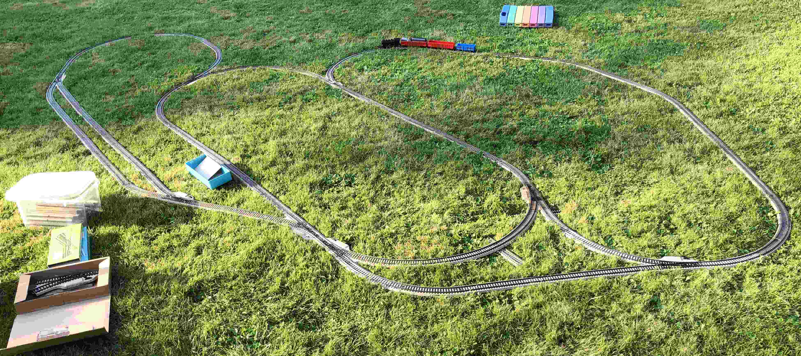
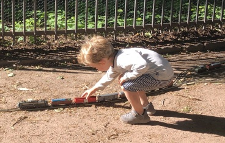
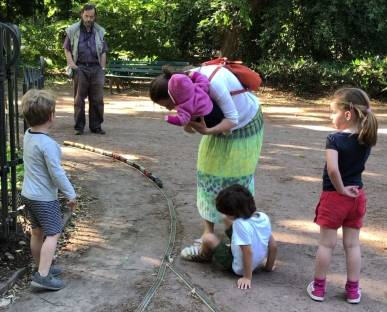

# PiedPiperS
Smartphone HTML control for model trains, using ESP32 microcontroller, WiFi access point, asynchronous webserver, WebSocket and JSON, outdoor compatible with on-board USB power supply 

   

The program purpose is to control a model train motor with independent power supply e.g. from USB power bank for outdoors. 
Following options exist:

1. Control from a smartphone: ESP32 Wifi WebServer for commands from a client browser via WebSocket connection:
   https://github.com/jorail/PiedPiperS
   
2. Control by a whistle: Original PiedPiper whistle Morse code signals. Works with microphone input and FFT tone 
   analysis in a Teensy 4.0 microcontroller (in this version tone sampling is deactivated for ESP32 by commenting out):
   https://github.com/jorail/PiedPiper
   
3. Switch or Touch-Pin Morse code input

4. SerialMonitor input commands by typing letters, requires connection via USB

The project is inspired by the project 'free your model train' (FYMT) proposed by Freie Softwarefreunde
at https://freie-software.org/free-your-model-train/

The code and layout are developed for ESP32 (or Teensy 4.0) but can easily be modified for other micro controllers.
Asynchronous WebServer libraries are used in combination with WebSocket connection and JSON messages.

PiedPiper Sound evaluation and tone signal identification is performed by FFT analysis in the microprocessor.
Identified client commands or Morse code commands from a switch, touch senosor or tone signals are processed to 
commands for change of the speed level. New motor settings are transfered via pulse width modulation (PWM) output 
to a H-bridge motor control IC.

The idea for the FFT analysis for tone identification and part of the functions are based on 'Audio Tone Input' 
(toneinput.ino) by Tony DiCola, which is published with MIT License as part of the ardafruit 
learning guide and examples at http://learn.adafruit.com/fft-fun-with-fourier-transforms/. The corresponding 
function headings are marked by 'MIT License'.

PiedPiperS facilitates train control from a website in the browser of a smart phone. It make use of an ESP32 microprocessor with built in WiFi. 
The building instructions (https://github.com/jorail/PiedPiperS/blob/main/PiedPiperS_Instruction.pdf)
include the electrical circuit layout, modification of the ESP32 Development Kit V1 and images of the resulting circuit design, wiring, 
testing, mounting of the complete setup. Further explanations for the PiedPiperS project, its application, additional photos and 
demonstration in short videos are provided in the [/docs](docs/) folder.

  

The microprocessor functions and interaction with the integrated circuit (IC) used as motor driver (TLE5206-2S or L293D) are 
modified or selectd by the initial #define statements. Corresponding sections of c++ code are used or omitted during compilation, 
as needed for the defined microprocessor and circuit layout. 

This also applies for the Tone Sampling functions, which originate from the PiedPiper project 
(see sister repository https://github.com/jorail/PiedPiper ).
Code sections between #ifdef ToneSampling ... #endif are not used, if ToneSampling is not defined in the beginning (or commented out).

The PiedPiperS c++ code is stored as <a href="PiedPiperS\data\PiedPiperS.ino" "PiedPiperS.ino"> file in a subfolder named PiedPiperS. So it is ready for use 
with ESP32 and many other microcontrollers and for compilation with Arduino IDE. Additional files and .html websites for the Web Server 
are stored in the sub-subfolder [/PiedPiperS/data](PiedPiperS/data/). This [/data](PiedPiperS/data/) folder is ready for transfer to ESP32 SPIFFS with Arduinio IDE. 
It includes a picuture file lok.png, which is used for identification of the locomotive and as button on the websites for changing from the control panel 
to other websites and back. A suitable size of this loco icon in lok.png is 360 pixels horizontal x ca. 100 vertical pixels.

The transfer of files to the microprocesor is accomplished with the Arduino IDE menue item >tools>ESP32 Sketch Data Upload. An introduction 
to ESP32 Web Server and use of SPIFFS with the required structuring of the file system is illustrated in this tutorial: 
https://randomnerdtutorials.com/esp32-web-server-spiffs-spi-flash-file-system/ . 
The principle of ESP32 serving as access point (AP) and the WebSocket protocol communication between the ESP32 as server and 
multiple clients are explained here: 
https://randomnerdtutorials.com/esp32-access-point-ap-web-server/ and
https://randomnerdtutorials.com/esp32-websocket-server-arduino/

Note that the flash memory on ESP32 is very limited, so that the size of files in the [/PiedPiperS/data](PiedPiperS/data/) folder has to be
strictly limited, too. This especially applies to images stored in a sub-sub-subfolder [/PiedPiperS/data/image](PiedPiperS/data/image/). 
Intentionally, the example images have very low resultion, in order to fit onto the ESP32 and in order to be available
during outdoor applications (i.e. perhaps away from Github). If the file size is larger than the flash memory available 
for SPIFFS on the ESP32, you can delete in your copy of the repository the last images in the [/image](PiedPiperS/data/image/) folder, 
the .zip file or .pdf file in the [/data](PiedPiperS/data/) folder for reducing the size of the SPIFFS upload without any significant 
impact on the structure and principle functioning of the code and html websites.

  	
	
After connecting to the Wifi you can always open the train control by typing the standard IP address:
http://192.168.4.1 This address for the initial request is also provided as QR code in the [/data](PiedPiperS/data/) folder. 

Note in the c++ code that the order of the server.on events is relevant as client requests are assessed starting from the top. 
Thus, in the middle of the c++ code you find the following order:
1. the specific server reply functions are placed in the beginning, 
   e.g. server.on("/", HTTP_GET, { ... });
2. followed by the general server function: server.serveStatic("/", SPIFFS, "/");
3. some known specific captivePoratal request events
4. the general CaptiveRequestHandler and 
5. as last backup: server.onNotFound link to the captivePortalTarget 

So far the used Web Server is not able to handle https:// requests. But most normal http:// requests are forwarded to the 
captivePortalTarget or CaptiveRequestHandler. The identical server AsyncResponseStreams are coded in c++ directly after 
the start of the AsyncWebServer. 

Additions from the lok.ini branch as of version 170, https://github.com/jorail/PiedPiperS/tree/lok.ini

The file lok.ini specifies the loco name, WiFi and motor parameters. It is read at the startup of the program and defines values of corresponding global variables. 
Later online modification and saving of a new parameter set is possible, but should be used with care and some knowledge of their program functionality. 

Optional: Online monitoring of power data by measuring motor current and supply voltage during operation by analog input reading at ESP32 ADC Channels 7 and 6. 
The current and voltage measurements require the addition of 4 measuring resistors between the step-up converter and the motor IC. The readings are
converted to display the power consumption of the motor online on the control panel. A dedicated /powerdata panel displays a chart.js diagram with
joint trends of speed settings, voltage, current and power use. Data is requrested every second by get requrests and the servers response is sent as JSON message. 

  
	
Optional, PiedPiPerS branch 'speedo', version 191, https://github.com/jorail/PiedPiperS/tree/speedo: 
Speed measurement from optical reading of passing railroad sleepers
Black or dark railway sleepers of the model railroad track are equally spaced. A reflective infrared (IR) sensor is used as sensor for their detection and 
for analog input to GPIO39, ADC1_CH3. This amendment includes an additional website speed.html with online display of speeddata. The data is optained by the 
request get /speeddata. Detection of sleepers can be indicted by LED on the microprocessor. The very simple electrical circuit required for this option is documented 
(see 'doc' folder) and consists of following few parts: 
1. reflective IR emitting and receiving diodes as sensor and as an integrated electronic part 
2. simple amplifier, consisting of one small and ordinary transistor and two resistors

The reflectiv IR sensor signal is converted to a frequency of passing railway sleepers and to a true speed over ground measurement in meters per second. 
This speed data is continuously updated, converted to the model scale speed in km/h and displayed on the train control panel. Alternatively it can by analysed in a 
chart.js diagram at speed.html together with the power data. 

Version 208 has a complete redifiontion of main loop timing variables and corresponding changes to lok.ini definitions. This facilitates up to 5000 Hz IR sampling.

The irsamplerecord.html, version 211, has a second chart display of single or average IR sample data. It allows for fine tuning of IR thresholds (IRlow, IRhigh) for
defining the voltage deadbeand for effective railway sleepter detection. Furthermore, this IR data recorder allows to sum the railway sleeper count
in one round, in order to check the completeness of the counting based on a known number of passed railway sleepers. The sum-counter is automatically
interrupted by a streched reflective track ground (e.g. white paper or tape applied on track). Choose the length of this strech so, that it yields > 1 second 
reflective IR signal during train passage. The data of the sum-counter is than copied and evaluated as dataset from 'last round' and the sum-counter is zeroed 
for the restart of a new round. This allows for simple and repeated control of the completeness of counting with different deadband settings, speed levels,
sensor position adjustments, environmental conditions.  

Version 237 has overcome a problem with interrupted and incomplete counting of railway sleepers by assigning the analog reading of IR sensor data to a parallel task
running on the second core0 of the ESP32 microprocessor. Complete sets of ca. 6000 Hz IR sensor samples are achieved. 

A complete instruction for building the ESP32 train control with step-up converter and motor control IC is provided as PDF file including photo documentation, 
electronic parts list and circuit drawings.

The options for power measurement and speed measurement are included as options 1 and 2. If you do not use these options, you can simplify the PiedPiperS.ino source code 
by commenting out the two corresponding lines at the start of the source code before compilation:

	#define  PowerSampling  //motor power sampling with ESP32
	
	#define  SpeedSampling //monitor speed on track by detecting railway sleeper passage with reflective infrared (IR) detector and ESP32
	
Version 244 including theses options for power and speed measurements has been successfully finalised and tested in branch 'speedo' and merged to Github PiedPiperS 'main' 
without source code conflicts on 2021-08-27: https://github.com/jorail/PiedPiperS 

Please feel invited to pass your comments on github or via e-mail, if you have any suggestions for further improvement or
new applications for PiedPiperS.

Have fun with it and invite other to play with it together... Jo

  
	
   
